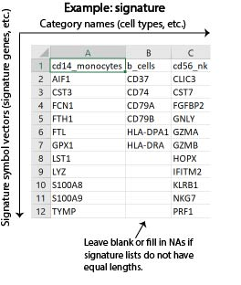

# SCINA
A semi-supervised category identification and assignment tool.
## Introduction
SCINA is an automatic cell type detection and assignment algorithm for single cell RNA-Seq (scRNA-seq) and Cytof/FACS data. SCINA is capable of assigning cell type identities to a pool of cells profiled by scRNA-Seq or Cytof/FACS data with prior knowledge of identifiers, such as genes and protein symbols, that are highly-expressed (or lowly-expressed) in each category. 

Please refer to our paper for more details of SCINA:
["SCINA: Semi-Supervised Typing of Single Cells *in silico*"](url pending) Zhang Z, Luo D, et al., 2018

Or please check our web server to run SCINA on the clould: http://lce.biohpc.swmed.edu/scina 

For more details on eTME signatures please refer to our paper:
["An Empirical Approach Leveraging Tumorgrafts to Dissect the Tumor Microenvironment in Renal Cell Carcinoma Identifies Missing Link to Prognostic Inflammatory Factors."](http://cancerdiscovery.aacrjournals.org/content/early/2018/06/08/2159-8290.CD-17-1246) Wang T, Lu R, et al., 2018

## Getting started with SCINA
The SCINA algorithm is constructed with R, and is originally developed as an R package. Users who are not famaliar with basic R programming are suggested to use our web server to run SCINA with a user-friendly GUI. 
### Installation Instructions
#### Install from CRAN
```{r}
install.packages('SCINA')
library('SCINA')
```
#### Install from GitHub
```{r}
library('devtools')
install_github('jcao89757/SCINA')
library('SCINA')
```
### Dependencies
R (version 2.15.0 or later)

**R Packages**

MASS, gplots, devtools (installation from GitHub only)
## Guided Tutorial
For this tutorial, we will be predicting cell types from a trimmed single-cell RNA sequencing (scRNA-seq) data matrix freely available from 10X Genomics. The signatures we used as prior knowledge are extracted from published eTME signatures (Wang T, et al., 2018). All the data we need for this tutorial is availiable at [here](https://github.com/jcao89757/SCINA/tree/master/inst/extdata).
### Prepare input data
The SCINA model takes at least two input data matracies to predict categories.
1. A normalized matrix representing the target dataset. Columns correpond to objects (cell barcodes for example), rows correspond to attributes or variables (gene symbols for example). Please find the [.RData example](https://github.com/jcao89757/SCINA/tree/master/inst/extdata/example_expmat.RData) and the [.csv example](https://github.com/jcao89757/SCINA/tree/master/inst/extdata/example_expmat.csv) for the target expression matrix.
2. A list contains multiple signature identifier lists. Each signature identifier list (genes for example) represents prior knowledge for one category (cell type for example), containing genes or protein symbols with high degree of detection. Please find the [.RData example](https://github.com/jcao89757/SCINA/tree/master/inst/extdata/example_signatures.RData) and the [.csv example](https://github.com/jcao89757/SCINA/tree/master/inst/extdata/example_signatures.csv) for the signature lists.

Both matrices can be uploaded from .Rdata files or .csv files. If the target dataset is uploaded with .csv files, the format requirements are the same as the descriptions above **(Fig.1)**. If the signature identifier list is uploaded with .csv files, each column contains one signature list, and its column name should be the name of the category. Each signature identifier list contains gene or protein symbols. The identifier lists do not need to have the same length **(Fig.2)**.


**Fig.1 |** An example of a target dataset in .csv format.



**Fig.2 |** An example of signature lists in .csv format.

After downloading, please load the matrices to your R environment.
```{r}
#.Rdata examples
load(system.file('extdata','example_expmat.RData', package = "SCINA"))
load(system.file('extdata','example_signatures.RData', package = "SCINA"))

# Or .csv examples
exp_test=read.csv('your/path/to/example_expmat.csv',row.names=1,stringsAsFactors = F)
signatures=preprocess.signatures('your/path/to/example_signatures.csv')
```
### Standard pre-processing workflow
### Set model parameters
### Predict object categories with SCINA
### Result visualization
## Version update
1.0.0: First release. (09-20-2018)
